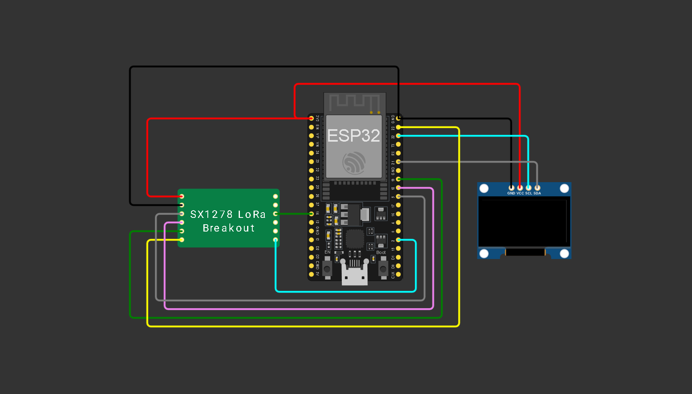
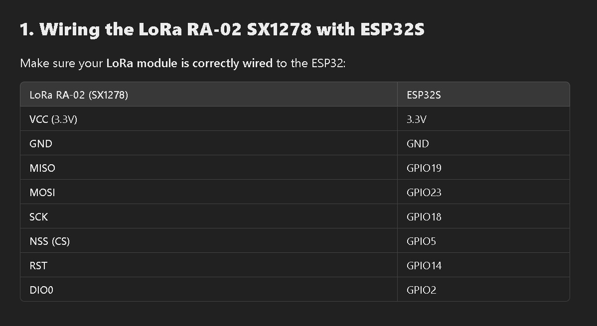

# Emergency Response Beacon and Communicator

A LoRa-based two-way emergency communication system using ESP32 
microcontroller, designed for distress signaling in areas without 
cellular coverage.

## Tech Stack
- ESP32 Microcontroller
- LoRa SX1278 Module (865-867 MHz)
- OLED 0.96 inch Display
- Arduino IDE / Embedded C

## Features
- 4 predefined emergency alert types: Stranded, Injury, Fire, Hostiles
- Two-way wireless messaging protocol
- 60m indoor transmission range
- Interrupt-driven button navigation
- OLED display UI with smooth scrolling

## Circuit Diagram

## Pin Connections

## How to Use
1. Flash MPMC_FINAL.ino to ESP32 using Arduino IDE
2. Connect components as per circuit diagram
3. Power both sender and receiver units
4. Press button to select and send emergency message

## Results
- Successfully transmitted and received all 4 message types
- Stores 3 most recent received messages
- Tested in closed environment with 60m range

## Project Report
Submitted for Microprocessors and Microcontrollers (BECE204L)
Vellore Institute of Technology, April 2024
